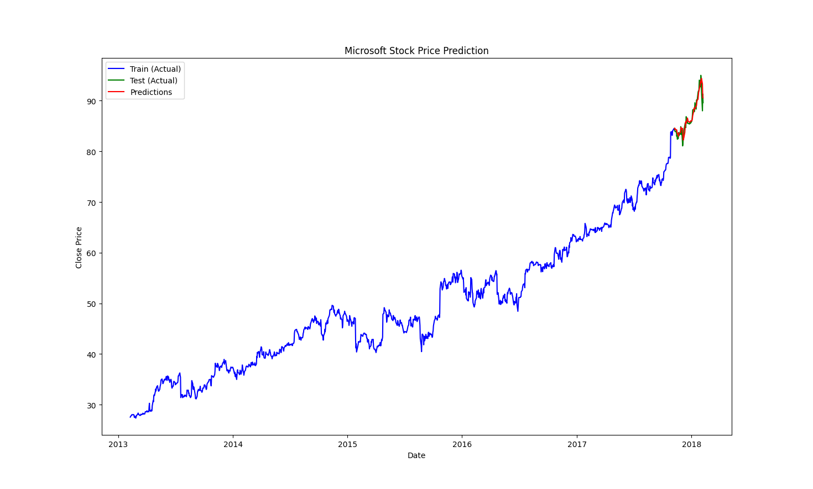

# LSTM Stock Price Predictor

This repository contains a minimal LSTM-based project for time-series forecasting of stock prices. The implementation is small and focused: it demonstrates data loading, preprocessing, an LSTM model built with Keras (TensorFlow backend), training, and a simple evaluation/plotting pipeline. The primary entry point is `LSTM_model/main.py`.

## Project Overview

- **Goal:** Predict future stock prices using an LSTM neural network on historical stock data.
- **Dataset:** `LSTM_model/MicrosoftStock.csv` — daily historical prices for Microsoft.
- **Model:** A sequential LSTM model (single or stacked layers depending on hyperparameters) trained to predict the adjusted closing price.

This repository is intended as an educational/experimentational example rather than a production-ready forecasting system.

## Files

- `LSTM_model/main.py`: Main script to run data preparation, model training, and plotting.
- `LSTM_model/MicrosoftStock.csv`: Input dataset (historical prices).
- `requirements.txt`: Python dependencies used for the project.
- `output_fig.png`: Example output plot generated by the training/evaluation script.

## Installation

Recommended: create and activate a Python virtual environment, then install dependencies from `requirements.txt`.

```bash
python3 -m venv .venv
source .venv/bin/activate
pip install -r requirements.txt
```

If you don't have `requirements.txt` up to date, the main dependencies are typically:

```bash
pip install numpy pandas matplotlib scikit-learn tensorflow
```

## Usage

Run the main script from the repository root (or from `LSTM_model`):

```bash
cd LSTM_model
python3 main.py
```

The script performs these steps:

1. Loads `MicrosoftStock.csv` and parses dates.
2. Selects features (e.g., adjusted close) and applies scaling.
3. Creates rolling windows / sequences for LSTM input.
4. Builds and trains an LSTM model.
5. Evaluates performance and saves/plots results.

After running, the script should produce a plot demonstrating model predictions vs. ground truth. An example output is included below.

## Example Output



Figure: Example plot showing actual vs. predicted values.
## Model Details

- Typical preprocessing: use `Close` or `Adj Close` column, fill or drop missing values, scale with `MinMaxScaler` or `StandardScaler`.
- Sequence construction: sliding windows of length `T` are used to build (X, y) pairs where X is a sequence of past timesteps and y is the next value.
- Training: mean squared error (MSE) or mean absolute error (MAE) is commonly used as the loss. Adam or RMSprop are typical optimizers.

Adjust `main.py` hyperparameters to experiment with sequence length, batch size, number of LSTM units, dropout, and learning rate.

## Reproducibility

- Set a random seed in `main.py` (NumPy, TensorFlow, Python `random`) for repeatable runs.
- Record package versions (`pip freeze > freeze.txt`) if you need to reproduce exact results.

## Troubleshooting

- If TensorFlow fails to import, verify you have a compatible Python version (3.8–3.11) and an appropriate TensorFlow wheel for your OS.
- If training is slow, try reducing dataset size, lowering the number of epochs, or using a GPU-enabled TensorFlow build.

